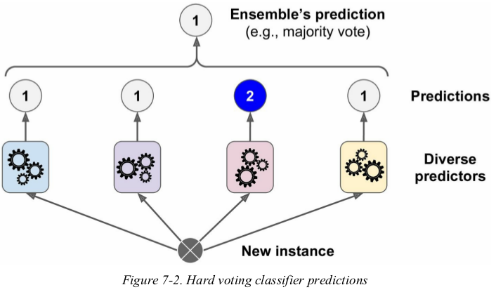
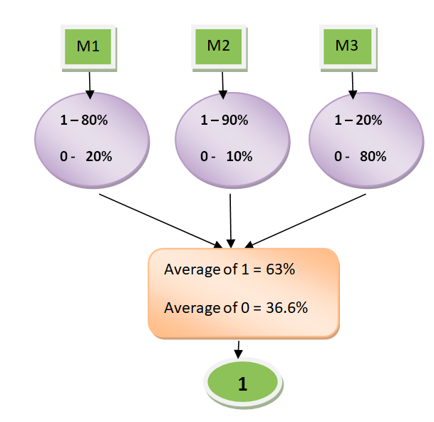

# Chapter 7 Ensemble Learning and Random Forests

Ensemble: A group of predictors.

 Ensemble Learning algorithm is called an Ensemble method:
Aggregate the predictions of a group of predictors to get predictions.(wisdom of crowd).

 ## Voting Classifiers

- Hard voting classifier:
 Create an even better classifier is to aggregate the predictions of each classifier and predict the class that gets the most votes. 


-Soft voting classifier:
All classifiers are able to estimate class probabilities,then to predict the class with the highest class probability, averaged over all the individual classifiers.

## Bagging and Pasting

- **Bagging (short for bootstrap aggregating)**: sampling with replacement. (`bootstrap=True`)
- **Pasting**: sampling without replacement.(`bootstrap=False`)

### Out-of-Bag Evaluation

In Bagging, Some instances may b not  sampled for any given predictor at all.By default a BaggingClassifier samples $m$ training instances with replacement (bootstrap=True), where $m$ is the size of the training set,we have 
$\underset{m→∞}{lim} 1  -(1 - \frac{1}{m})^m = 1 - e^{-1}=63.2%$. 
This means that only about 63% of the training instances are sampled on average for each predictor.The remaining 37% of the training instances that are not sampled are called $out-of-bag (oob)$ instances. 
- Note that they are not the same 37% for all predictors.

## Random Patches and Random Subspaces

### Random forests

- Random Forests = Bagging + Decision Trees

A Random Forest is an ensemble of Decision Trees, generally trained via the bagging method (or sometimes pasting).

The algorithm results in greater tree diversity:
 - Trades **a higher bias for a lower variance**, generally yielding an overall better model.
 - Reduce the overfitting by decision trees


The Random Forest algorithm introduces extra randomness when growing trees; instead of searching for the very best feature when splitting a node, it searches for the best feature among a random subset of features. 


- Extra Trees

`It is hard to tell in advance whether a RandomForestClassifier will perform better or worse than an ExtraTreesClassifier. Gen‐erally, the only way to know is to try both and compare them using cross-validation (tuning the hyperparameters using grid search).`

When you are growing a tree in a Random Forest, at each node only a random subset of the features is considered for splitting (as discussed earlier). It is possible to make trees even more random by also using random thresholds for each feature rather than searching for the best possible thresholds (like regular Decision Trees do).
A forest of such extremely random trees is called an $\textit{Extremely Randomized Trees ensemble (or Extra-Trees for short)}$. Once again, this technique trades **more bias for a lower variance**. It also makes Extra-Trees much faster to train than regular Random Forests, because finding the best possible threshold for each feature at every node is one of the most time-consuming tasks of growing a tree.

### Feature importance

In Random Forests method, measure the relative importance of each feature by looking at how much the tree nodes that use that feature reduce impurity on average (across all trees in the forest). More precisely, it is a weighted average, where each node’s weight is equal to the number of training samples that are associated with it

## Boosting

Boosting (originally called $hypothes\ boosting$) refers to any Ensemble method that can **combine several weak learners into a strong learner**. 


**The general idea of most boosting methods is to train predictors sequentially, each trying to correct its predecessor.**

Key word of boosting: 
- Additive model
- Forward stafewise
### **Additive mode**l

Additive model: Strong Classifier is made up with several weak classifiers which sum up together.

$$
F_M(x;P) = ∑_{m=1}^nβ_Mh(x;a_m)
$$
where 
- $h(x:a_m)$ is weak classifier
- $a_m$ is the best parameter of the weak classifier
- $β_m$is the weight of the weak class in the strong classifier
- $P$ is all the conbinations of $a_m$ and $β_m$

### **Forward stagewise**

Forward stagewise:

The next interated classifier is trained the previous classifier:

$$
F_m(x) = F_{m-1}(x) + β_mh_m(x;a_m)
$$


Main boosting methods:
- AdaBoost
- Gradient Boosting
  - XGBoost
  - LightBGM

### AdaBoost

- “Adaptive Boosting”
    
    One way for a **new predictor to correct its predecessor is to pay a bit more attention to the training instances that the predecessor underfitted**. This results in new predictors focusing more and more on the hard cases.

- the higher the weight, the more often it has been misclassified.

    When training an AdaBoost classifier, the algorithm first trains a base classifier (such as a Decision Tree) and uses it to make predictions on the training set.The algorithm then increases the relative weight of misclassified training instances.Then it trains a second classifier, using the updated weights, and again makes predic‐tions on the training set, updates the instance weights, and so on.

Steps:

- Initially, Each instance weight $w(i)$ is set to $1/m$. A first predictor is trained, and its **weighted error rate** $r_1$ is computed on the training set:
$$
\mathop{r_j} = \frac{\underset{\hat{y_j}^{(i)} ≠\ y^{(i)}}{∑_{i=1}^m}w^{(i)}}{∑_{i=1}^mw^{(i)}}
\tag{Equation 7-1}
$$

where $\hat{y_j}^{(i)}$ is the $jth$ predictor’s prediction for the $ith$ instance.

- The predictor’s weight $α_j$ is then computed using Equation 7-2:

$$
\mathop{α_j} = η\ log \frac{1-r_j}{r_j}
\tag{Equation 7-2}
$$

where $η$ is the **learning rate** hyperparameter (defaults to 1). The more accurate the predictor is, the higher its weight will be. If it is just guessing randomly, then its weight will be close to zero. However, if it is most often wrong.

**So the adaboost update the weights of weak classifiers by the error rates**

- Next, the AdaBoost algorithm updates the instance weights, using Equation 7-3, which boosts the weights of the misclassified instances:

Weight update rule: for $i=1,2,⋯,m$
$$
w^{(i)}←
\begin{cases}
w^{(i)} & \text{if}  \hat{y_j^{(i)}} = y^{(i)}\\
w^{(i)}exp(α_j)&  \text{if}  \hat{y_j^{(i)}} ≠ y^{(i)}
\end{cases}
\tag{Equation 7-3}
$$

Then all the **instance weights are normalized**:(divided by $∑_{i=1}^m w^{(i)}$).

- Finally, a new predictor is trained using the updated weights, and the whole process is repeated *(the new predictor’s weight is computed, the instance weights are updated, then another predictor is trained, and so on)*. The algorithm **stops when the $desired$ number of predictors is reached, or when a perfect predictor is found.** To make predictions, AdaBoost simply computes the predictions of all the predictors and weighs them using the predictor weights $α_j$. The predicted class is the one that receives the majority of weighted votes (see Equation 7-4).

Equation 7-4. AdaBoost predictions
$$
\hat{y}(\bf x) = arg \underset{k}max{} \underset{\hat{y_j(\bf x)=k}}{∑_{j = 1}^N α_j}
\tag{Equation  7-4}
$$

where $N$ is the number of predictors.

### Gradient Boosting


Just like AdaBoost,Gradient Boosting works by sequentially adding predictors to an ensemble, each one correcting its predecessor. However, instead of tweaking the instance weights at every iteration like AdaBoost does, this method tries to **fit the new predictor to the residual errors made by the previous predictor**.

This is the Gradient Boosting method showned by `DecisionTreeRegressor`: 


```python
from sklearn.tree import DecisiontreeRegressor
tree_reg1 = DecisionTreeRegressor(max_depth=2) 
tree_reg1.fit(X, y)
# Then we train a third regressor on the residual errors made by the second predictor: 
y2 = y - tree_reg1.predict(X) 
tree_reg2 = DecisionTreeRegressor(max_depth=2) 
tree_reg2.fit(X, y2) 

y3 = y2 - tree_reg2.predict(X) 
tree_reg3 = DecisionTreeRegressor(max_depth=2) 
tree_reg3.fit(X, y3) 

# Now we have an ensemble containing three trees. It can make predictions on a new instance simply by adding up the predictions of all the trees:
y_pred = sum(tree.predict(X_new) for tree in (tree_reg1, tree_reg2, tree_reg3))
```
notice the functions: `y3 = y2 - tree_reg2.predict(X)` and the sum:`y_pred = sum(tree.predict(X_new) for tree in (tree_reg1, tree_reg2, tree_reg3))`,they explain that **"fit the new predictor to the residual errors made by the previous predictor"**.

However, the functions showed above tell us how the Gradient Boosting works, and feel the gradient. `GradientBoostingRegressor` is the api we can apply with this method.

- Optimization:In order to find the optimal number of trees, you can use early stopping

### XGBoost

It is worth noting that an optimized implementation of Gradient Boosting is available in the popular Python library XGBoost, which stands for Extreme Gradient Boosting.
This package was initially developed by Tianqi Chen as part of the Distributed (Deep) Machine Learning Community (DMLC), and it aims to be extremely fast, scalable, and portable. In fact, XGBoost is often an important component of the winning entries in ML competitions. XGBoost’s API is quite similar to Scikit-Learn’s:

- GDBT 加法模型 前向优化算法 Taylor Expansion
  - why  2nd Order in Taylor Expansion? The changing of gradients is 2nd order


### LightGBM
