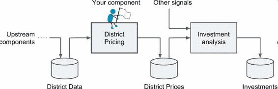

# 1. Chap02 End-to-End Machine Learning Project feat. Checklist

Appendix B and my summary.

## 1.1. Machine Learning Project Checklist

### 1.1.1. Machine Learning projects main steps:

1. **Frame the problem and look at the big picture**.
2. Get the data.
3. Explore the data to gain insights.
4. **Prepare the data** to better expose the underlying data patterns to Machine Learn‐ing algorithms.
5. Explore many different models and shortlist the best ones.
6. Fine-tune your models and combine them into a great solution.
7. Present your solution.
8. Launch, monitor, and maintain your system.

### 1.1.2. Pipelines (Essential!)

**A sequence** of data processing components is called a data pipeline.

**Pipelines** are very common in Machine Learning systems, since there is a lot of data to manipulate and many data transformations to apply.

 

$$
\text{Figure 2-2. A Machine Learning pipeline for real estate investments}
$$

管道

Components typically run asynchronously.

- Each component pulls in a large amount of data, processes it, and spits out the result in another data store. Then, some time later, the next component in the pipeline pulls this data and spits out its own output.

- Each component is fairly self-contained: the interface between components is simply the data store. This makes the system simple to grasp (with the help of a data flow graph), and different teams can focus on different components.

- If a component breaks down, the downstream components can often continue to run normally (at least for a while) by just using the last output from the broken component.This makes the architecture quite robust.However, a broken component can go unnoticed for some time if proper monitoring is not implemented. The data gets stale and the overall system’s perfor‐mance drops.

### 1.1.3. Frame the Problem and Look at the Big Picture

1. Define the objective in business terms.
2. How will your solution be used?
3. What are the current solutions/workarounds (if any)?
4. How should you frame this problem (supervised/unsupervised, online/offline, etc.)?
5. How should performance be measured?
6. Is the performance measure **aligned with the business objective**?
7. What would be the **minimum performance** needed to reach the business objec‐tive?
8. What are **comparable problems? Can you reuse experience or tools?**
   - Some of the best ideas to problems are **already being done by other competitors and other industries**, and bringing these existing solutions to the table can help to get started and identify alternative approaches.
9. Is human expertise available?
10. How would you solve the problem manually?
11. **List the assumptions** you (or others) have made so far. 12.**Verify assumptions if possible.**
12. Keep on rethinking! add more here.

### 1.1.4. Get the Data

1.  **List the data you need and how much you need**.
2.  Find and **document** where you can get that data.
3.  Check **how much space it will take**.
4.  Check **legal obligations, and get authorization if necessary.**
5.  Get **access authorizations.**
6.  Create a workspace (with enough storage space).
7.  Get the data.
8.  Convert the data to a format you can easily manipulat
    - Without changing the data itself.
9.  Ensure **sensitive information** is deleted or protected (e.g., anonymized).
10. Check the **size and type** of data (time series, sample, geographical, etc.).
11. **Sample** a test set, **put it aside**, and never look at it.

### Split and Sample the dataset Notes:

- Create the training/test set to avoid **data snooping bias**.
- Purely random sampling methods is generally fine if the dataset is large enough (especially relative to the number of attributes), but if it is not, you run the risk of **introducing a significant sampling bias**, so you need **stratified sampling**.
- However, we do not need to statify sampling every dataset, finllay we will **compare** the preformance of **Sampling methods**, (e.g, Overall, Stratified and Random sampling methods), in order to determine whether we need the stratified sampling or NOT.
- Test set generation is an often neglected but ritical part of a Machine Learning project,Moreover, many of these ideas will be useful later when we discuss crossvalidation.

### 1.1.5. **Explore the Data**-Try to get insights from a field expert for these steps.

1. Create a copy of the data for exploration (sampling it down to a manageable size if necessary).
2. Create a Jupyter notebook to keep a record of your data exploration.
3. **Study each attribute and its characteristics:**

- Name
- Type (categorical, int/float, bounded/unbounded, text, structured, etc.)
- % of missing values
- Noisiness and type of noise (stochastic, outliers, rounding errors, etc.)
- Usefulness for the task
- Type of distribution (Gaussian, uniform, logarithmic, etc.)

4. For **supervised learning** tasks, **identify the target attribute(s)**.
5. **Visualize the data**.
6. Study the **correlations between attributes**.

   - The correlation coefficient ranges from –1 to 1. When it is close to 1, it means that there is a strong positive correlation; for example, the median house value tends to go up when the median income goes up. When the coefficient is close to –1, it means that there is a strong negative correlation; you can see a small negative correlation between the latitude and the median house value (i.e., prices have a slight tendency to go down when you go north). Finally, coefficients close to 0 mean that there is no linear correlation:

      

    
   Figure shows various plots along with the correlation coeffi‐cient between their horizontal and vertical axes.

7. Study how you would solve the problem manually.
8. Identify the promising transformations you may want to apply.
9. **Identify extra data** that would be useful (go back to “Get the Data”)
10. **Document what you have learned**.

### 1.1.6. Prepare the Data

#### 1.1.6.1. Note: Rules of Preparing the Data

- Work on copies of the data (keep the original dataset intact).
- Write functions for all data transformations you apply, for five reasons:

  1. So you can easily prepare the data the next time you get a fresh dataset.
  2. So you can apply these transformations in future projects.
  3. To clean and prepare the test set.
  4. To clean and prepare new data instances once your solution is live.
  5. To make it easy to **treat your preparation choices as hyperparameters**

#### 1.1.6.2. Main steps:

1. Data cleaning:

   - Fix or remove outliers (optional).
   - Fill in missing values (e.g., with zero, mean, median…) or drop their rows (or columns).

2. Feature selection (optional):Drop the attributes that provide no useful information for the task.

3. Feature engineering:

   - Discretize continuous features.
   - Decompose features (e.g., categorical, date/time, etc.).
   - Add promising transformations of features (e.g., log(x), sqrt(x), x2, etc.).
   - Aggregate features into promising new features.

4. Feature **scaling: Standardize or normalize features**.

- Standardize features:$\frac{x_i = x_{min}}{x_{max}}$,simpliest;
- Normalize features:$\frac{x_i - μ}{σ}$,problems for some algorithms but muchu less affected by **outliers**.

### 1.1.2. **Shortlist** the Promising Models

1. Train many quick-and-dirty models from different categories (e.g., linear, naive Bayes, SVM, Random Forest, neural net, etc.) using standard parameters.
2. Measure and compare their performance.
3. - For each model, use $\text{N-fold cross-validation}$ and compute the mean and stan‐dard deviation of the performance measure on the $N\ folds$.

4. Analyze the **most significant variables for each algorithm**.
5. Analyze the types of errors the models make:What data would a human have used to avoid these errors?
6. Perform a quick round of feature selection and engineering.
7. Perform one or two more quick iterations of the five previous steps.
8. **Shortlist the top three to five most promising models**, preferring models that make different types of errors.

#### 1.1.2.1. Be aware:

- If the data is huge, you may want to sample smaller training sets so you can train many different models in a reasonable time (be aware that this penalizes complex models such as large neural nets or Random Forests).

- Try to **automate these steps** as much as possible.

### 1.1.2. Fine-Tune the System

1. Fine-tune the hyperparameters using **cross-validation**:

   - Treat your data transformation choices as hyperparameters, especially when you are not sure about them (e.g., if you’re not sure whether to replace missing values with zeros or with the median value, or to just drop the rows).

   - **Unless there are very few hyperparameter** values to explore, **prefer random search over grid search**. If training is very long, you may prefer a Bayesian optimization approach (e.g., using Gaussian process priors.)

2. Try Ensemble methods. Combining your best models will often produce better performance than running them individually.

3. Once you are confident about your final model, measure its performance on the test set to estimate the generalization error.

Notes:

- You will want to use as much data as possible for this step, especially as you move toward the end of fine-tuning.
- As always, automate what you can.
- Don’t tweak your model after measuring the generalization error: you would just start overfitting the test set.

### 1.1.3. Present Your Solution

1. Document what you have done.
2. Create a nice presentation: Make sure you **highlight the big picture** first.
3. **Explain why** your solution achieves the business objective.
4. Don’t forget to present **interesting points** you noticed along the way:

   - Describe what worked and what did not.
   - List your assumptions and your system’s limitations.

5. Ensure your **key findings are communicated through beautiful visualizations or easy-to-remember statements**

### 1.1.4. Launch,Monitor, and Maintain

1. Get your solution ready for production.
2. **Write monitoring code** to check your system’s live performance at regular intervals and trigger alerts when it drops.

   - Beware of slow degradation: models' performance would slow down as **data evolves**.
   - Measuring performance may require a **human pipeline** (e.g., via a crowdsourcing service).
   - Also monitor your inputs’ quality. Particularly important for online learning systems.

3. Retrain your models on a regular basis on fresh data (**automate** as much as possible).
