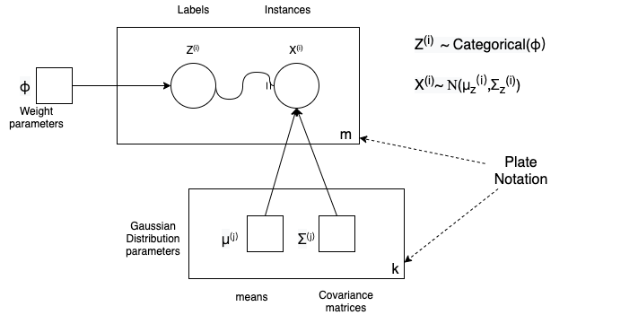
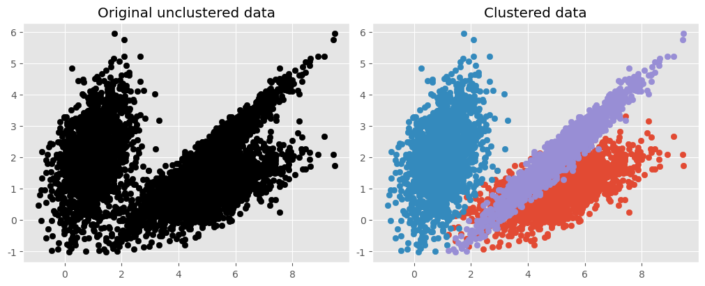

# Ch 9 Unsupervised Learning Techniques

# Tasks & Algorithms

- Tasks :

  - Clustering
  - Anomaly detection
  - Density estimation

- Algorithms
  - K-Means
  - DBSCAN
  - Gaussian mixture models
  - EM(Expectation Maximization)

# Clustering

$$
\textit{Birds of a feather flock together.}
$$

A cluster depends on the context, and different algorithms will capture different kinds of clusters:

- Centroid
- Continuous regions of densely packed instances
- Clusters of clusters,etc.

Two popular clustering algorithms:**K-Means and DBSCAN**

# K-means

- Def k, find centroids of k clusters

- Computational complexity
  - Generally linear with regard to the number of instances $m$, the number of clusters $k$, and the number of dimensions $n$ **when the data has a clustering structure**. If not, boom exponentially with the number of instances.

## Finding the optimal number of clusters

- silhouette score
- silhouette diagram

## Compare with KNN

- KNN

  - Classification
  - Supervised(Labled dataset)
  - Find the nearest $k$ data points

- K-means
  - Clustering
  - Unsupervised
  - Find the centroids of the $k$ clusters

## Limits of K-means

- Def k every time when test with iterations
- Does not behave very well when the clusters have varying sizes

**Note**

It is **important to scale the input features before you run K-Means**, or the clusters may be very stretched and K-Means will perform poorly.

# DBSCAN

**Density-based spatial clustering of applications with noise** (DBSCAN) works well if all the clusters are dense enough and if they are well sep‐arated by low-density regions.

How it works:

1. For each instance, the algorithm counts how many instances are located within a small distance $ε$ from it. This region is called the instance’s $ϵ$ neighborhood.
2. If an instance has at least **min_samples instances** in its $ε$-neighborhood (including itself), then it is considered a **core instance**,which located in dense regions.
3. All instances in the neighborhood of a core instance belong to the same cluster.This neighborhood may include other core instances; therefore, a long sequence of neighboring core instances forms a single cluster.
4. Any instance that is not a core instance and does not have one in its neighborhood is considered an anomaly.

# Gaussian mixture models

## Compare K-Means with Gaussian mixture models

- K-means algorithm
  - Assigned each example to exactly one cluster
  - What if clusters are overlapping?
    - Hard to tell which cluster is right
    - Maybe we should try to remain uncertain
  - Used Euclidean distance
  - What if cluster has a non-circular shape?
- Gaussian mixture models
  - Clusters modeled as Gaussians
    - Not just by their mean
  - EM algorithm: assign data to cluster with some probability
  - Gives probability model of $x$ ("generative")

## A Gaussian mixture model

A Gaussian mixture model **(GMM)** is a $\textit{probabilistic model}$ that assumes that the instances were generated from a mixture of several **Gaussian distributions** whose parameters are unknown.

- GMM variants:

  - The number $k$ of Gaussian distributions.
  - The dataset $\bf{X}$ generated through the following probabilistic process:
  - A cluster is picked randomly from among $k$ clusters.
  - The probability of choosing the $j$th cluster is defined by the cluster’s $weight, φ^{(j)}$. The index of the cluster chosen for the $i$th instance is noted $z^{(i)}$.

    - If $z^{(i)} = j$, meaning the $i$th instance has been assigned to the $j$th cluster, the location$x^{(i)}$ of this instance is sampled randomly from the Gaussian distribution with mean $\bf{μ^{(j)}}$ and **covariance matrix** $\bf{Σ^{(j)}}$,which is noted $\bf{X}^{(i)}  ∼  N(\bf{μ^{(j)}},\bf{Σ^{(j)}})$

- A graphical representation of a Gaussian mixture model, including its parameters (squares), random variables (circles), and their conditional dependencies (solid arrows)
- “Latent assignment" $z$: we observe $x$, but $z$ is hidden.

GMM Model:

$$
\mathop{p(x)}= ∑_{i=1}^kϕ^{(j)}N(\bf{μ^{(j)}},\bf{Σ^{(j)}})
$$

How the weights calculated?

- EM(Expectation Maximization) algorithm.

## EM(Expectation Maximization)

Model parameter estimation with latent variables

### E-step (“Expectation")

- For each datum (example) $x$ in the dataset, calculate the probability that it belongs to each of the $k$ clusters.
- Normalize to sum to one (over $k$ clusters )
- If $x^{(i)}$ is very likely under the $j$th Gaussian, it gets high weight $ϕ^{(j)}$

### M-step (“Maximization" )

- For each cluster $z^{(i)} = j$
- Update its parameters using the (weighted) data points
- Each step **increases** the log-likelihood of our model
- Iterate until convergence
  - Convergence guaranteed
  - Local optima: initialization often important

### EM Notes:

EM is a general framework for partially observed data:

- “Complete data’ $X$
- Assignments $z$ are missing (unobserved)

EM corresponds to:

- Computing the distribution over all $z^{(i)}$ given the parameters
- Maximizing the“expected complete”log likelihood
- GMMs = plug in“soft assignments”, but not always so easy

Alternatives: Stochastic EM, Hard EM

- Instead of expectations, just sample the $z^{(i)}$ or choose best (often easier)- Called “imputing”the values of $z$

- Hard EM:
  - Assignments are known
  - No missing data, values, clusters
  - Similar to EM, but less“smooth", more local minima

Stochastic EM:

- Similar to EM, but with extra randomness
- Not obvious when it has converged

### GMM & EM Summary

Gaussian mixture models

- Flexible class of probability distributions
- Explain variation with hidden groupings or clusters of data
- Latent “membership” $z^{(i)}$
- Feature values $x^{(i)}$ are Gaussian given $z^{(i)}$

Expectation-Maximization

- Compute soft membership probabilities, "responsibility": $Contribution$
- Update mixture component parameters given soft memberships
- Ascent on log-likelihood: convergent, but local optima

Selecting the number of clusters

- Penalized likelihood or validation data likelihood
