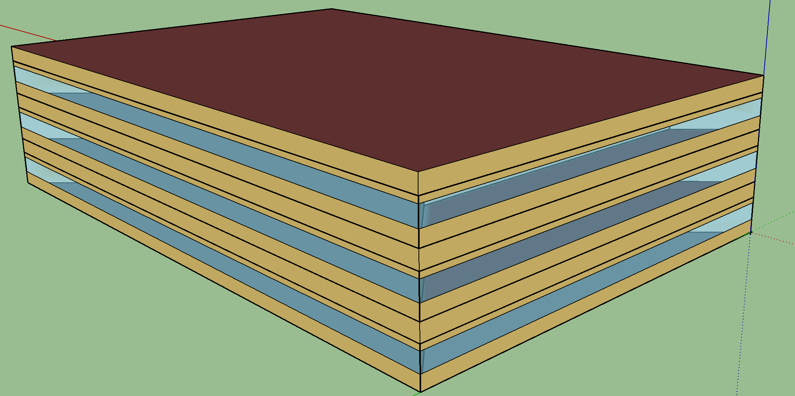
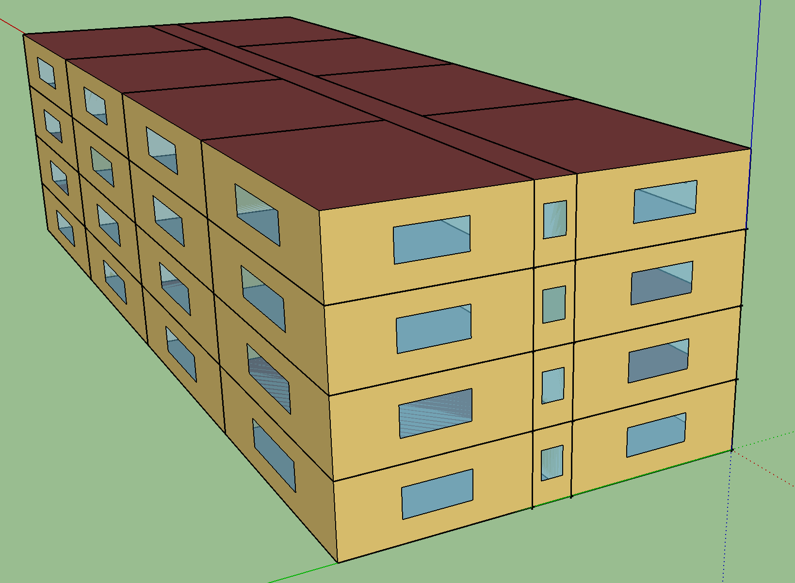

# Project 2 Analysis of Building Electricity Demand

## In this project, you are going to work on a model to predict building electricity demand. We have two buildings to analyze.

- ### 1. Office space: Area = 4,982 $m^2$ (53,628 $ft^2$); Number of Stories = 3.

- ### 2. Residential space: Area = 3,135 $m^2$ (33,742 $ft^2$); Number of Stories = 4.

### As you can see, the schema of this data contains the date and time variables and weather conditions as the input (X vector) along with total and HVAC electricity demand (in W) as the target variables (labels).

- #### **Assume that the electricity demand is the average hourly demand and it can be interpreted as the hourly consumption in $Wh$.**

https://en.wikipedia.org/wiki/Wet-bulb_temperature

https://www.weather.gov/source/zhu/ZHU_Training_Page/definitions/dry_wet_bulb_definition/dry_wet_bulb.html#:~:text=The%20Dry%20Bulb%20temperature%2C%20usually,to%20the%20ambient%20air%20temperature.1

The wet-bulb temperature (WBT) is the temperature read by a thermometer covered in water-soaked (water at ambient temperature) cloth (a wet-bulb thermometer) over which air is passed.[1] At 100% relative humidity, the wet-bulb temperature is equal to the air temperature (dry-bulb temperature); at lower humidity the wet-bulb temperature is lower than dry-bulb temperature because of evaporative cooling.

The wet-bulb temperature is defined as the temperature of a parcel of air cooled to saturation (100% relative humidity) by the evaporation of water into it, with the latent heat supplied by the parcel.[2] A wet-bulb thermometer indicates a temperature close to the true (thermodynamic) wet-bulb temperature. The wet-bulb temperature is the lowest temperature that can be reached under current ambient conditions by the evaporation of water only.

- Wet-bulb depression
  - Wet-bulb depression 的计算方法是湿球温度减去干球温度。1 Wet-bulb depression 的应用包括气象学、空调、制冷和加湿等领域。1
  - Wet-bulb depression 是指当空气的相对湿度降低时，干球温度和湿球温度之间的差异增加。1 湿球温度是指空气的某个区域被冷却到饱和（相对湿度为100%）时的温度，因为水蒸气的蒸发而产生。2 湿球温度与干球温度之间的差异称为 Wet-bulb depression。2

例如，如果干球温度为 30°C，湿球温度为 20°C，则 Wet-bulb depression 为 10°C。

## Answer the following questions (each answer needs full explanation and plotting would not suffice):

### 1- Compare the total and HVAC electricity consumption of the two buildings on a monthly and annual basis. (a bar chart is preferred)

### 2- Plot and describe the distribution of the weather data.

### 3- Report the correlations between weather conditions and HVAC demand for each building.

### 4- Create a scatter plot of the weather conditions vs HVAC demand and explain what you can learn from these associations for each building.

### 5- Split the data into training and test with a ratio of 0.2 as the test data.

### 6- Create a linear regression model and train it based on the training data using weather conditions as the feature set and HVAC demand as the label for each building.

- ### Before training, do not forget to standardize your input.
- ### Report the MSE value for the training and test data for both buildings.

### 7- Incorporate the role of season and time of day into your regression model by introducing two sets of categorical variables:

- ### First, explain how to add categorical variables into a regression model through OneHotEncoder in sklearn and what OneHotEncoder is (we did not cover this in our lecture and this is defined as an assignment for you.)
- ### Second, use OneHotEncoder object and transform 'month' column and concatenate it to your weather conditions input.
- ### Third, use pandas map method and convert the 'hour' column values as follows:
  - #### {0,1,2,3,4,5}-->value=0
  - #### {6,7,8,9}-->value=1
  - #### {10,11,12}-->value=2
  - #### {13,14,15,16}-->value=3
  - #### {17,18,19}-->value=4
  - #### {20,21,22,23}-->value=5
- ### Fourth, apply OneHotEncoder on this new column and concatenate it to your input.

- https://www.epa.gov/climate-indicators/climate-change-indicators-seasonal-temperature
- https://www.epa.gov/sites/default/files/2021-04/documents/seasonal_temperature_-_td.pdf

- The three-month seasons are defined as follows: winter (December, January, February), spring (March, April, May), summer (June, July, August), and fall (September, October, November)

In this indicator, the four seasons correspond with the meteorological seasons. Winter corresponds to
the months December–February, spring is March–May, summer is June–August, and fall is September–
November. NOAA averaged monthly means across each three-month period to derive seasonal
temperature data points for each year

### 8- Repeat question 6 with the new dataset for both buildings and report any improvement you see in training and test MSE values.

### 9- Explain what regularization is in supervised learning and repeat step 8 using sklearn Ridge and Lasso classes based on the below instruction:

- ### Use Ridge from https://scikit-learn.org/stable/modules/generated/sklearn.linear_model.Ridge.htmlLinks to an external site. and report and plot test MSE for alpha={0, 0.005, 0.05,0.1,1}
- ### Use Lasso from https://scikit-learn.org/stable/modules/generated/sklearn.linear_model.Lasso.htmlLinks to an external site. and report and plot test MSE for alpha={0, 0.005, 0.05,0.1,1}.

### 10- Use the following sklearn regressors and compare the training and test MSE values and report the model with the best generalization (do not change the default values for these objects):

- #### AdaBoostRegressor
- #### BaggingRegressor
- #### SVR
- #### RandomForestRegressor
