# SQL NOTES

增删改查

CREATE DATABASE TABLE VIEW

ALTER TABLE VIEW

- DATABASE 也有，修改数据库要格外警惕

```sql
CREATE

```

**AND 运算符优先于 OR 运算符** ，想要优先执行 OR 运算，可以使用 **括号** ：

```sql
-- 通过使用括号让 OR 运算符先于 AND 运算符执行
SELECT product_name, product_type, regist_date
  FROM product
 WHERE product_type = '办公用品'
   AND ( regist_date = '2009-09-11'
        OR regist_date = '2009-09-20'); ## 此处  regist_date 可以省略
```

### 聚合函数

SQL 中用于汇总的函数叫做聚合函数。以下五个是最常用的聚合函数：

- COUNT：计算表中的记录数（行数）
- SUM：计算表中数值列中数据的合计值
- AVG：计算表中数值列中数据的平均值
- MAX：求出表中任意列中数据的最大值
- MIN：求出表中任意列中数据的最小值

使用聚合函数删除重复值

```sql
-- 计算去除重复数据后的数据行数
SELECT COUNT(DISTINCT product_type)
 FROM product;
-- 是否使用 DISTINCT 时的动作差异（SUM 函数）
SELECT SUM(sale_price), SUM(DISTINCT sale_price)
 FROM product;
```

Note:

- COUNT 函数的结果根据参数的不同而不同。COUNT(\*) 会得到包含 NULL 的数据行数，而 COUNT(<列名>) 会得到 NULL 之外的数据行数。
- 聚合函数会将 NULL 排除在外。但 COUNT(\*) 例外，并不会排除 NULL。
- MAX/MIN 函数几乎适用于所有数据类型的列。SUM/AVG 函数只适用于数值类型的列。
- 想要计算值的种类时，可以在 COUNT 函数的参数中使用 DISTINCT。
- 在聚合函数的参数中使用 DISTINCT，可以删除重复数据。

### GROUP BY

GROUP BY 就像是切分表的一把刀

```sql
-- 按照商品种类统计数据行数
SELECT product_type, COUNT(*)
  FROM product
 GROUP BY product_type;
 -- 不含 GROUP BY
SELECT product_type, COUNT(*)
  FROM product
```

### HAVING 特点

HAVING 子句用于对分组进行过滤，可以使用数字、聚合函数和 GROUP BY 中指定的列名（聚合键）。

```sql
-- 数字
SELECT product_type, COUNT(*)
  FROM product
 GROUP BY product_type
HAVING COUNT(*) = 2;
-- 错误形式（因为 product_name 不包含在 GROUP BY 聚合键中）
SELECT product_type, COUNT(*)
  FROM product
 GROUP BY product_type
HAVING product_name = '圆珠笔';
```

## 对查询结果进行排序

### ORDER BY

SQL 中的执行结果是随机排列的，当需要按照特定顺序排序时，可以使用 ORDER BY 子句

默认为升序排列，降序排列为 DESC

```sql

\-\- 降序排列

SELECT product\_id, product\_name, sale\_price, purchase\_price

 FROM product

 ORDER BY sale_price DESC;

\-\- 多个排序键

SELECT product\_id, product\_name, sale\_price, purchase\_price

 FROM product

 ORDER BY sale\_price, product\_id;

\-\- 当用于排序的列名中含有NULL时，NULL会在开头或末尾进行汇总。

SELECT product\_id, product\_name, sale\_price, purchase\_price

 FROM product

 ORDER BY purchase_price;

```

SQL 在使用 HAVING 子句时 SELECT 语句的顺序为：

FROM → WHERE → GROUP BY → HAVING → SELECT → ORDER BY.

## 视图

视图是一个虚拟的表，不同于直接操作数据表，视图是依据 SELECT 语句来创建的（会在下面具体介绍），所以操作视图时会根据创建视图的 SELECT 语句生成一张虚拟表，然后在这张虚拟表上做 SQL 操作。

视图与表的区别：表保存了实际数据，视图不保存，只是窗口

### 为什么会存在视图

1\. 通过定义视图可以将频繁使用的 SELECT 语句保存以提高效率。

2\. 通过定义视图可以使用户看到的数据更加清晰。

3\. 通过定义视图可以不对外公开数据表全部字段，增强数据的保密性。

4\. 通过定义视图可以降低数据的冗余。

### 需要注意

在一般的 DBMS 中定义视图时不能使用 ORDER BY 语句。下面这样定义视图是**错误**的。

```sql

CREATE   VIEW productsum (product\_type, cnt\_product)

AS

SELECT product_type, COUNT(*)

 FROM product

 GROUP BY product_type

 ORDER BY product_type;

```

需要注意的是在一般的 DBMS 中定义视图时不能使用 ORDER BY 语句。

视图和表一样，**数据行都是没有顺序的**。

_在 MySQL 中视图的定义是允许使用 ORDER BY 语句的，但是若从特定视图进行选择，而该视图使用了自己的 ORDER BY 语句，则视图定义中的 ORDER BY 将被忽略。_

### 基于单表的视图

我们在 product 表的基础上创建一个视图，如下：

```sql


CREATE VIEW productsum (product_type, cnt_product)
AS
SELECT product_type, COUNT(*)
  FROM product
 GROUP BY product_type ;
```

### 基于多表的视图

为了学习多表视图，我们再创建一张表 `shop_product`，相关代码如下：

```sql

CREATE TABLE shop_product

(shop_id    CHAR(4)       NOT NULL,

 shop_name  VARCHAR(200)  NOT NULL,

 product_id CHAR(4)       NOT NULL,

 quantity   INTEGER       NOT NULL,

 PRIMARY KEY (shop_id, product_id));
```

INSERT INTO shop_product

(shop_id, shop_name, product_id, quantity)

VALUES

('000A', '东京', '0001', 30),

('000A', '东京', '0002', 50),

('000A', '东京', '0003', 15),

('000B', '名古屋', '0002', 30),

('000B', '名古屋', '0003', 120),

('000B', '名古屋', '0004', 20),

('000B', '名古屋', '0006', 10),

('000B', '名古屋', '0007', 40),

('000C', '大阪', '0003', 20),

('000C', '大阪', '0004', 50),

('000C', '大阪', '0006', 90),

('000C', '大阪', '0007', 70),

('000D', '福冈', '0001', 100);

我们在 product 表和 shop_product 表的基础上创建视图。

```sql

CREATE VIEW view_shop_product(product_type, sale_price, shop_name)

AS

SELECT product_type, sale_price, shop_name

  FROM product,

       shop_product

 WHERE product.product_id = shop_product.product_id;

```

我们可以在这个视图的基础上进行查询

```sql

SELECT sale_price, shop_name

  FROM view_shop_product

 WHERE product_type = '衣服';

```

```sql

CREATE VIEW view_shop_product(product_type, sale_price, shop_name)

AS

SELECT product_type, sale_price, shop_name

  FROM product,

       shop_product

 WHERE product.product_id = shop_product.product_id;

```

### 修改视图结构

```sql

ALTER VIEW <视图名> AS <SELECT语句>

```

### 如何删除视图

删除视图的基本语法如下：

```sql

DROP VIEW <视图名1> [ , <视图名2> …]

```

注意：需要有相应的权限才能成功删除。

## 子查询

子查询指一个查询语句嵌套在另一个查询语句内部的查询，这个特性从 MySQL 4.1 开始引入，在 SELECT 子句中先计算子查询，子查询结果作为外层另一个查询的过滤条件，查询可以基于一个表或者多个表。

**虽然嵌套子查询可以查询出结果，但是随着子查询嵌套的层数的叠加，SQL 语句不仅会难以理解而且执行效率也会很差，所以要尽量避免这样的使用。**

### 标量子查询

标量就是单一的意思，那么标量子查询也就是单一的子查询

所谓单一就是要求我们执行的 SQL 语句只能返回一个值，也就是要返回表中具体的**某一行的某一列**。

通过标量子查询语句查询出销售单价高于平均销售单价的商品。

```sql

SELECT product_id, product_name, sale_price

  FROM product

 WHERE sale_price > (SELECT AVG(sale_price) FROM product);

```

上面的这条语句首先后半部分查询出 product 表中的平均售价，前面的 sql 语句在根据 WHERE 条件挑选出合适的商品。

由于标量子查询的特性，导致标量子查询不仅仅局限于 WHERE 子句中，通常任何可以使用单一值的位置都可以使用。也就是说，能够使用常数或者列名的地方，无论是 SELECT 子句、GROUP BY 子句、HAVING 子句，还是 ORDER BY 子句，几乎所有的地方都可以使用。

还可以这样：

```sql
SELECT product_id,
       product_name,
       sale_price,
       (SELECT AVG(sale_price)
          FROM product) AS avg_price
  FROM product;
```

- 其中，括号内： (SELECT AVG(sale_price) FROM product) AS avg_price 是一个整体

### 关联子查询

观察这种查询方式，考虑为什么要这样定义 p1 和 p2：

```sql

SELECT product_type, product_name, sale_price

  FROM product AS p1

 WHERE sale_price > (SELECT AVG(sale_price)

   FROM product AS p2

                      WHERE p1.product_type = p2.product_type

   GROUP BY product_type);

```

在这里我们简要的概括为：

1. 首先执行不带 WHERE 的主查询
2. 根据主查询讯结果匹配 product_type，获取子查询结果
3. 将子查询结果再与主查询结合执行完整的 SQL 语句

\*在子查询中像标量子查询，嵌套子查询或者关联子查询可以看作是子查询的一种操作方式即可。

### 视图子查询小结

视图和子查询是数据库操作中较为基础的内容，对于一些复杂的查询需要使用子查询加一些条件语句组合才能得到正确的结果。但是无论如何对于一个 SQL 语句来说都不应该设计的层数非常深且特别复杂，不仅可读性差而且执行效率也难以保证，所以尽量有简洁的语句来完成需要的功能。

关联子查询中我们将外面的 product 表标记为 p1，将内部的 product 设置为 p2，而且通过 WHERE 语句连接了两个查询。

## 各种函数

- 算术函数（用来进行数值计算的函数）
- 字符串函数（用来进行字符串操作的函数）
- 日期函数（用来进行日期操作的函数）
- 转换函数（用来转换数据类型和值的函数）
- 聚合函数（用来进行数据聚合的函数）

### 算术函数（用来进行数值计算的函数）

- ABS -- 绝对值

语法：`ABS( 数值 )`

ABS 函数用于计算一个数字的绝对值，表示一个数到原点的距离。

当 ABS 函数的参数为`NULL`时，返回值也是`NULL`。

- MOD -- 求余数

语法：`MOD( 被除数，除数 )`

MOD 是计算除法余数（求余）的函数，是 modulo 的缩写。小数没有余数的概念，只能对整数列求余数。

注意：主流的 DBMS 都支持 MOD 函数，只有 SQL Server 不支持该函数，其使用`%`符号来计算余数。

- ROUND -- 四舍五入

语法：`ROUND( 对象数值，保留小数的位数 )`

ROUND 函数用来进行四舍五入操作。

注意：当参数 **保留小数的位数** 为变量时，可能会遇到错误，请谨慎使用变量。

### 字符串函数（用来进行字符串操作的函数）

语法：`CONCAT(str1, str2, str3)`

MySQL 中使用 CONCAT 函数进行拼接。

- LENGTH -- 字符串长度

语法：`LENGTH( 字符串 )`

- LOWER -- 小写转换

LOWER 函数只能针对英文字母使用，它会将参数中的字符串全都转换为小写。该函数不适用于英文字母以外的场合，不影响原本就是小写的字符。

类似的，UPPER 函数用于大写转换。

- REPLACE -- 字符串的替换

语法：`REPLACE( 对象字符串，替换前的字符串，替换后的字符串 )`

- SUBSTRING -- 字符串的截取

语法：`SUBSTRING （对象字符串 FROM 截取的起始位置 FOR 截取的字符数）`

- **（扩展内容）SUBSTRING_INDEX -- 字符串按索引截取**

语法：`SUBSTRING_INDEX (原始字符串， 分隔符，n)`

该函数用来获取原始字符串按照分隔符分割后，第 n 个分隔符之前（或之后）的子字符串，支持正向和反向索引，索引起始值分别为 1 和 -1。

### 日期函数（用来进行日期操作的函数）

不同 DBMS 的日期函数语法各有不同 特定 DBMS 的日期函数查阅文档即可。

- CURRENT_DATE -- 获取当前日期

  - SELECT CURRENT_DATE;
- CURRENT_TIME -- 当前时间

  - SELECT CURRENT_TIME;
- CURRENT_TIMESTAMP -- 当前日期和时间

  - SELECT CURRENT_TIMESTAMP;
- EXTRACT -- 截取日期元素

  ```sql
  SELECT CURRENT_TIMESTAMP AS NOW,
  EXTRACT(YEAR FROM CURRENT_TIMESTAMP) AS year,
  EXTRACT(MONTH FROM CURRENT_TIMESTAMP) AS month,
  EXTRACT(DAY FROM CURRENT_TIMESTAMP) AS day,
  EXTRACT(HOUR FROM CURRENT_TIMESTAMP) AS hour,
  EXTRACT(MINUTE FROM CURRENT_TIMESTAMP) AS minute,
  EXTRACT(SECOND FROM CURRENT_TIMESTAMP) AS second;
  ```

### 转换函数（用来转换数据类型和值的函数)

“转换”这个词的含义非常广泛，在 SQL 中主要有两层意思：数据类型转换、值的转换。

- 一是数据类型的转换，简称为类型转换，在英语中称为`cast`

```sql
SELECT CAST('0001' AS SIGNED INTEGER) AS int_col;

SELECT CAST('2009-12-14' AS DATE) AS Date_col
```

- COALESCE -- 将 NULL 转换为其他值

语法：`COALESCE(数据1，数据2，数据3……)`

COALESCE 是 SQL 特有的函数。该函数会返回可变参数 A 中左侧开始第 1 个不是 NULL 的值。参数个数是可变的，因此可以根据需要无限增加。

在 SQL 语句中将 NULL 转换为其他值时就会用到转换函数。

## 谓词 predicate

谓词就是返回值为真值的函数。

- 包括`TRUE / FALSE / UNKNOWN`。
- 谓词主要有以下几个：
  - LIKE、BETWEEN、IS NULL、IS NOT NULL、IN、EXISTS

### LIKE 谓词 一致查询

当需要进行字符串的部分一致查询时需要使用该谓词。

部分一致大体可以分为

前方一致：hello%

中间一致：%hello%

后方一致：%hello

下划线`_` 用来匹配任意 1 个字符

```sql
SELECT
  *
FROM
  samplelike
WHERE
  strcol LIKE '%ddd';
-- 后方一致
```

### BETWEEN 谓词 -- 用于范围查询

使用 BETWEEN 可以进行范围查询。该谓词与其他谓词或者函数的不同之处在于它使用了 3 个参数。

BETWEEN 的特点就是结果中会包含 100 和 1000 这两个临界值，也就是闭区间。如果不想让结果中包含临界值，那就必须使用 < 和 >。

### IS NULL、IS NOT NULL -- 用于判断是否为 NULL

IS NULL、IS NOT NULL -- 用于判断是否为 NULL，互为取反

### IN 谓词 -- OR 的简便用法

多个查询条件取并集时可以选择使用`or`语句。

随着希望选取的对象越来越多，SQL 语句也会越来越长，阅读起来也会越来越困难。这时，我们就可以使用 IN 谓词
`IN(值 1, 值 2, 值 3, ......) 来替换上述 SQL OR 语句。

- IN 取反 NOT IN

需要注意的是，在使用 IN 和 NOT IN 时是无法选取出 NULL 数据的。
实际结果也是如此，上述两组结果中都不包含进货单价为 NULL 的叉子和圆珠笔。NULL 只能使用 IS NULL 和 IS NOT NULL 来进行判断。

```sql
SELECT product_name, purchase_price
FROM product
WHERE purchase_price = 320
OR purchase_price = 500
OR purchase_price = 5000;

SELECT product_name, purchase_price
FROM product
WHERE purchase_price IN (320, 500, 5000);
```

### 子查询 + IN 谓词 联合查询（作为 IN 谓词的参数）

IN 谓词（NOT IN 谓词）可以使用子查询作为其参数。

子查询就是 SQL 内部生成的表，能够将表作为 IN 的参数。

同理，我们还可以说“能够将视图作为 IN 的参数”。

### 子查询+IN 两个优点：

①：实际生活中，某个门店的在售商品是不断变化的，使用 in 谓词就需要经常更新 sql 语句，降低了效率，提高了维护成本；

②：实际上，某个门店的在售商品可能有成百上千个，手工维护在售商品编号真是个大工程。

使用子查询即可保持 sql 语句不变，极大提高了程序的可维护性，这是系统开发中需要重点考虑的内容。

- NOT IN 和子查询

NOT IN 同样支持子查询作为参数，用法和 in 完全一样。

### EXIST 谓词

谓词的作用就是 **“判断是否存在满足某种条件的记录”**。

① EXIST 的使用方法与之前的都不相同

② 语法理解起来比较困难

③ 实际上即使不使用 EXIST，基本上也都可以使用 IN（或者 NOT IN）来代替

- EXIST 谓词的使用方法

如果存在这样的记录就返回真（TRUE），如果不存在就返回假（FALSE）。

- EXIST（存在）谓词的主语是“记录”。

```sql
SELECT product_name,sale_price
FROM product AS p
WHERE EXISTS(
    SELECT * FROM shopproduct AS sp
    WHERE sp.shop_id = '000C'
    AND sp.product_id = p.product_id
);
```

- EXIST 的参数

之前我们学过的谓词，基本上都是像“列 LIKE 字符串”或者“列 BETWEEN 值 1 AND 值 2”这样需要指定 2 个以上的参数，而 EXIST 的左侧并没有任何参数。因为 EXIST 是只有 1 个参数的谓词。所以，EXIST 只需要在右侧书写 1 个参数，该参数通常都会是一个子查询。

- 可以把在 EXIST 的子查询中书写 SELECT \* 当作 SQL 的一种习惯。

```sql
FROM product AS p
WHERE NOT EXISTS (SELECT * FROM shopproduct AS sp
    WHERE sp.shop_id = '000C'
    AND sp.product_id = p.product_id);
```

- 使用 NOT EXIST 替换 NOT IN，就像 EXIST 可以用来替换 IN 一样，NOT IN 也可以用 NOT EXIST 来替换。
- NOT EXIST 与 EXIST 相反，当“不存在”满足子查询中指定条件的记录时返回真（TRUE）。

## CASE 表达式

CASE 表达式是函数的一种，是 SQL 中数一数二的重要功能。

CASE 表达式是在区分情况时使用的，这种情况的区分在编程中通常称为（条件）分支。

CASE 表达式的语法分为

- 简单 CASE 表达式
- 搜索 CASE 表达式（重点介绍）
- 语法：

  - ```sql
    CASE WHEN <求值表达式> THEN <表达式>

         WHEN <求值表达式> THEN <表达式>

         WHEN <求值表达式> THEN <表达式>

         ...
    ELSE <表达式>

    END
    ```

### 场景 1 根据不同分支得到不同列值

```sql

SELECT  product_name,

        CASE WHEN product_type = '衣服' THEN CONCAT('A ： ',product_type)

             WHEN product_type = '办公用品'  THEN CONCAT('B ： ',product_type)

             WHEN product_type = '厨房用具'  THEN CONCAT('C ： ',product_type)

             ELSE NULL

        END AS abc_product_type

  FROM  product;

+--------------+------------------+

| product_name | abc_product_type |

+--------------+------------------+

| T恤          | A ： 衣服        |

| 打孔器       | B ： 办公用品    |

| 运动T恤      | A ： 衣服        |

| 菜刀         | C ： 厨房用具    |

| 高压锅       | C ： 厨房用具    |

| 叉子         | C ： 厨房用具    |

| 擦菜板       | C ： 厨房用具    |

| 圆珠笔       | B ： 办公用品    |

+--------------+------------------+


```

- “形参"： 'A ： ',product_type
- “实参"：A：衣服
- 注意语法结构：
  - ELSE 子句也可以省略不写，这时会被默认为 ELSE NULL。但为了防止有人漏读，还是希望大家能够显式地写出 ELSE 子句。
  - 此外，CASE 表达式最后的“END”是不能省略的，请大家特别注意不要遗漏。忘记书写 END 会发生语法错误，这也是初学时最容易犯的错误。

### 应用场景 2：实现列方向上的聚合

```sql
SELECT product_type,
    SUM(sale_price) AS sum_price
FROM product
GROUP BY product_type;
```

#### 在列的方向上展示不同种类额聚合值

聚合函数 + CASE WHEN 表达式即可实现该效果

### 应用场景 3：实现行转列 T

````sql
SELECT name,

   SUM(CASE WHEN subject = '语文' THEN score ELSE null END) as chinese,

   SUM(CASE WHEN subject = '数学' THEN score ELSE null END) as math,

   SUM(CASE WHEN subject = '外语' THEN score ELSE null END) as english
FROM score

GROUP BY name;s


## 集合运算


`集合`在数学领域表示“各种各样的事物的总和”, 在数据库领域表示记录的集合. 具体来说,表、视图和查询的执行结果都是记录的集合, 其中的元素为表或者查询结果中的每一行。

在标准 SQL 中, 分别对检索结果使用 `UNION`, `INTERSECT,` `EXCEPT` 来将检索结果进行并,交和差运算, 像`UNION`,`INTERSECT`, `EXCEPT`这种用来进行集合运算的运算符称为集合运算符。

- 标的加减法运算
- 连结： 内连结，外连结
- 多表连结 交叉连结


### 加法 UNION （取并集）

两个集合相加取并集，交集部分不会重复（主动删除）:

```sql
SELECT product_id, product_name
  FROM product
 UNION
SELECT product_id, product_name
  FROM product2;
````

练习

假设连锁店想要增加毛利率超过 50%或者售价低于 800 的货物的存货量, 请使用 UNION 对分别满足上述两个条件的商品的查询结果求并集。

## 集合运算

集合`在数学领域表示“各种各样的事物的总和”, 在数据库领域表示记录的集合. 具体来说,表、视图和查询的执行结果都是记录的集合, 其中的元素为表或者查询结果中的每一行。

在标准 SQL 中, 分别对检索结果使用 `UNION`, `INTERSECT,` `EXCEPT` 来将检索结果进行并,交和差运算, 像`UNION`,`INTERSECT`, `EXCEPT`这种用来进行集合运算的运算符称为集合运算符。

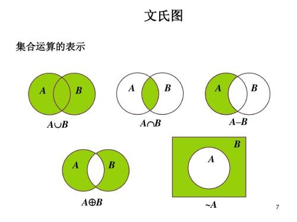

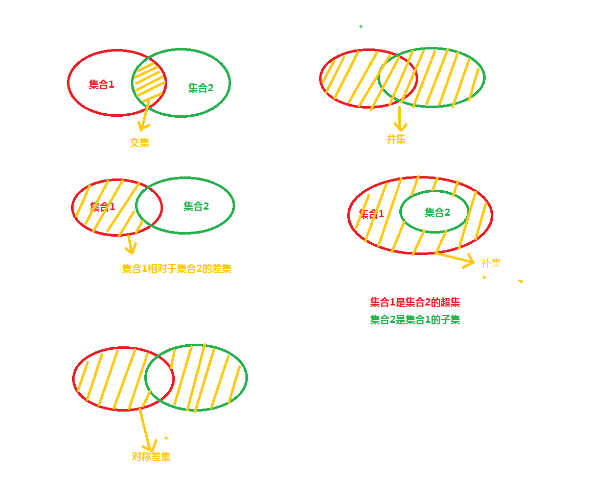

在数据库中, 所有的表--以及查询结果--都可以视为集合, 因此也可以把表视为集合进行上述集合运算

在很多时候, 这种抽象非常有助于对复杂查询问题给出一个可行的思路。

### 加法 UNION （取并集）

UNION 等集合运算符通常都会除去重复的记录。

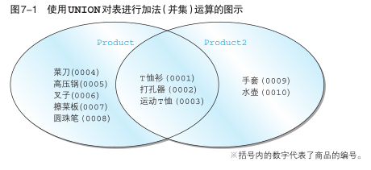

```sql
SELECT product_id, product_name
  FROM product
 UNION
SELECT product_id, product_name
  FROM product2;

```

**练习题:**

假设连锁店想要增加毛利率超过 50%或者售价低于 800 的货物的存货量, 请使用 UNION 对分别满足上述两个条件的商品的查询结果求并集。

结果应该类似于:

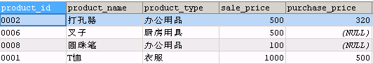

```sql
SELECT  product_id,product_name,product_type
       ,sale_price,purchase_price
  FROM PRODUCT
 WHERE sale_price<800

 UNION

SELECT  product_id,product_name,product_type
       ,sale_price,purchase_price
  FROM PRODUCT
 WHERE sale_price>1.5*purchase_price;
```

如果不使用 UNION 该怎么写查询语句?

```sql
SELECT product_id, product_name, product_type, sale_price,purchase_price
FROM product
WHERE sale_price < 800
OR sale_price > 1.5 * purchase_price;

```

### 加法 UNION 与 OR 谓词

UNION 对两个查询结果取并集, 和在一个查询中使用 WHERE 子句, 然后使用 OR 谓词连接两个查询条件, 能够得到相同的结果。

那么是不是就没必要引入 UNION 了呢? 当然不是这样的. 确实, 对于同一个表的两个不同的筛选结果集, 使用 UNION 对两个结果集取并集, 和把两个子查询的筛选条件用 OR 谓词连接, 会得到相同的结果, 但倘若要将两个不同的表中的结果合并在一起, 就不得不使用 UNION 了。

**练习题 :**

分别使用 UNION 或者 OR 谓词,找出毛利率不足 30%或毛利率未知的商品。

```sql
-- 使用 OR 谓词
SELECT * 
  FROM Product 
 WHERE sale_price / purchase_price < 1.3
    OR sale_price / purchase_price IS NULL;


-- 使用 UNION
SELECT *
  FROM Product
 WHERE sale_price / purchase_price < 1.3

 UNION
SELECT *
  FROM Product
 WHERE sale_price / purchase_price IS NULL;

```

### 包含重复行的集合运算 UNION ALL

不去重：不取并集，有啥说啥，保留重复行

```sql
SELECT product_id, product_name
  FROM Product
 UNION ALL
SELECT product_id, product_name
  FROM Product2;
```

### 隐式数据类型转换

通常来说, 我们会把类型完全一致, 并且代表相同属性的列使用 UNION 合并到一起显示, 但有时候, 即使数据类型不完全相同, 也会通过隐式类型转换来将两个类型不同的列放在一列里显示, 例如字符串和数值类型:隐式数据类型转换

```sql
SELECT product_id, product_name, '1'
  FROM Product
 UNION
SELECT product_id, product_name,sale_price
  FROM Product2;
```

### MySQL 8.0 不支持交运算 INTERSECT 取交集，需要 inner join

```sq
FROM Product p1
INNER JOIN Product2 p2
ON p1.product_id=p2.product_id
```

### 差集,补集与表的减法

求集合差集的减法运算和实数的减法运算有些不同, 当使用一个集合 A 减去另一个集合 B 的时候,对于只存在于集合 B 而不存在于集合 A 的元素, 采取直接忽略的策略,因此集合 A 和 B 做减法只是将集合 A 中也同时属于集合 B 的元素减掉。

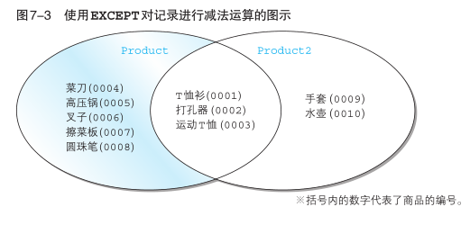

### However,MySQL 8.0 还不支持 EXCEPT 运算，需要 NOT IN

MySQL 8.0 还不支持 表的减法运算符 EXCEPT. 不过, 借助第六章学过的 NOT IN 谓词, 我们同样可以实现表的减法。

**练习题:**

找出只存在于 Product 表但不存在于 Product2 表的商品。

```sql
SELECT * FROM product
WHERE product_id NOT IN (SELECT product_id FROM product2);
```

### 同一个表：EXCEPT 与 NOT 谓词

通过上述练习题的 MySQL 解法, 我们发现, 使用 NOT IN 谓词, 基本上可以实现和 SQL 标准语法中的 EXCEPT 运算相同的效果。

**练习题:**

使用 NOT 谓词进行集合的减法运算, 求出 Product 表中, 售价高于 2000,但利润低于 30%的商品, 结果应该如下表所示。


参考答案:

```sql
SELECT *
  FROM Product
 WHERE sale_price > 2000
   AND product_id NOT IN (SELECT product_id
                            FROM Product
                           WHERE sale_price>1.3*purchase_price)

```

### （同一个表）INTERSECT 与 AND 谓词取交集

对于同一个表的两个查询结果而言, 他们的交 INTERSECT 实际上可以等价地将两个查询的检索条件用 AND 谓词连接来实现。

**练习题:**

使用 AND 谓词查找 product 表中利润率高于 50%,并且售价低于 1500 的商品,查询结果如下所示。


```sql
SELECT * FROM Product
WHERE sale_price > 1.5 * purchase_price
AND sale_price < 1500
```

### 对称差

两个集合 A,B 的对称差是指那些**仅属于 A 或仅属于 B 的元素构成的集合**：两个集合交集的补集，各自独有的元素合并在一起。

对称差也是个非常基础的运算, 例如, **两个集合的交就可以看作是两个集合的并去掉两个集合的对称差**.上述方法在其他数据库里也可以用来简单地实现表或查询结果的对称差运算: 首先使用 UNION 求两个表的并集, 然后使用 INTERSECT 求两个表的交集, 然后用并集减去交集, 就得到了对称差。

但由于在 MySQL 8.0 里, 由于两个表或查询结果的并不能直接求出来, 因此并不适合使用上述思路来求对称差. 好在还有差集运算可以使用. 从直观上就能看出来, 两个集合的对称差等于 A-B 并上 B-A, 因此实践中可以用这个思路来求对称差。

练习题:

使用 Product 表和 Product2 表的对称差来查询哪些商品只在其中一张表, 结果类似于:

sql

-- 使用 NOT IN 实现两个表的差集
SELECT _
FROM Product
WHERE product_id NOT IN (SELECT product_id FROM Product2)
UNION
SELECT _
FROM Product2
WHERE product_id NOT IN (SELECT product_id FROM Product)

### 迂回实现交集运算 INTERSECT

借助并集和差集：我们发现, 两个集合的交可以看作是两个集合的并去掉两个集合的对称差。

## 连结 JOIN 列操作

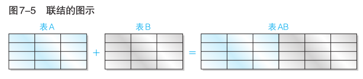

连结(JOIN)就是使用某种关联条件(一般是使用相等判断谓词"="), 将其他表中的列添加过来, 进行“添加列”的集合运算. 可以说,连结是 SQL 查询的核心操作, 掌握了连结, 能够从两张甚至多张表中获取列, 能够将过去使用关联子查询等过于复杂的查询简化为更加易读的形式, 以及进行一些更加复杂的查询。

### INNER JOIN 内连结

基本语法：

```sql
-- 内连结
FROM <tb_1> INNER JOIN <tb_2> ON <condition(s)>

```

观察：连结是列操作，ON 后面跟的情况是两个表格相同的某种列状况：

所以问题的关键是, 找出一个类似于"轴"或者"桥梁"的**公共列**, 将两张表用这个列连结起来。这就是连结运算所要作的事情。

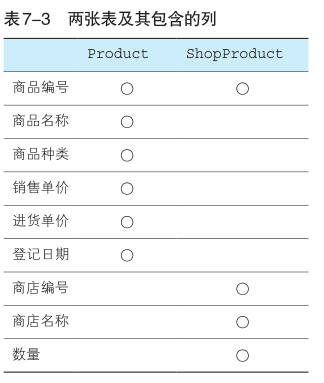

对于 product 和 shopproduct 来讲，公共列就是商品编号：product_id

```sql
  SELECT SP.shop_id,SP.shop_name, SP.product_id,
  P.product_name,P.product_type,P.sale_price,SP.quantity
  FROM ShopProduct AS SP
  INNER JOIN Product AS P
  ON SP.product_id = P.product_id;
```

注意：内连结三点重点：

1. 内连结要在 FROM 子句种使用多张表
2. 必须使用 ON 子句来指定连结条件
3. 规范代码：SELECT 子句按照**表名.列名**的格式来使用

#### 结合 WHERE 子句使用内连结

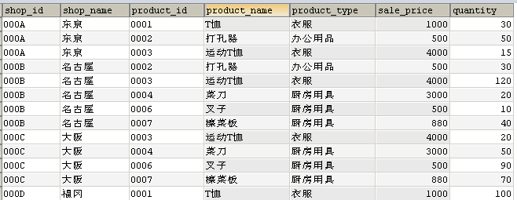

用 WHERE 子句，在刚才连结好的表格里面找到在东京销售的衣服，同时还带上原来的这些列

查询的执行顺序:

**FROM 子句->WHERE 子句->SELECT 子句**

内连结捆绑在 FROM 子句里面

```sql
SELECT SP.shop_id
       ,SP.shop_name
       ,SP.product_id
       ,P.product_name
       ,P.product_type
       ,P.sale_price
       ,SP.quantity
  FROM ShopProduct AS SP
 INNER JOIN Product AS P
    ON (SP.product_id = P.product_id
   AND SP.shop_name = '东京'
   AND P.product_type = '衣服') ;

```

#### 结合 GROUP BY 子句使用内连结

结合 GROUP BY 子句使用内连结, 需要根据分组列位于哪个表区别对待。

最简单的情形, 是在内连结之前就使用 GROUP BY 子句.

但是如果分组列和被聚合的列不在同一张表, 且二者都未被用于连结两张表, 则只能先连结, 再聚合。

例：每个商店中, 售价最高的商品的售价分别是多少?

```sql
-- 参考答案
SELECT SP.shop_id
      ,SP.shop_name
      ,MAX(P.sale_price) AS max_price
  FROM shopproduct AS SP
 INNER JOIN product AS P
    ON SP.product_id = P.product_id
 GROUP BY SP.shop_id,SP.shop_name

```

#### 自连结(SELF JOIN)

之前的内连结, 连结的都是不一样的两个表。但实际上一张表也可以与自身作连结, 这种连接称之为自连结. 需要注意, 自连结并不是区分于内连结和外连结的第三种连结, 自连结可以是外连结也可以是内连结, 它是不同于内连结外连结的另一个连结的分类方法。

#### 内连结与关联子查询

回忆第五章第三节关联子查询中的问题: 找出每个商品种类当中售价高于该类商品的平均售价的商品.当时我们是使用关联子查询来实现的:

```sql
SELECT product_name , product_type,sale_price
FROM  product AS P1
WHERE sale_price  > (SELECT AVG(sale_price) FROM product AS P2
                                         WHERE P1.product_type = P2.product_type
                                         GROUP BY product_type);
```

使用内连结同样可以解决这个问题:（三步走，思路更清晰）

1. 使用 GROUP BY 按商品类别分类计算每类商品的平均价格。

```sql
SELECT product_type, AVG(sale_price) AS ang_price
FROM product
GROUP BY product_type;
```

2. 接下来, 将上述查询与表 Product 按照 product_type (商品种类)进行内连结

```sql
SELECT P1.product_id
              ,P1.product_name
              ,P1.product_type
              ,P1.sale_price
              ,P2.avg_price
FROM product AS P1
INNER JOIN (SELECT product_type,AVG(sale_price) AS avg_price
            FROM product
            GROUP BY product_type) AS P2
            ON P1.product_type = P2.product_type;
```

3. 增加 WHERE 子句, 找出那些售价高于该类商品平均价格的商品.完整的代码如下:

```sql
SELECT P1.product_id
              ,P1.product_name
              ,P1.product_type
              ,P1.sale_price
              ,P2.avg_price
FROM product AS P1
INNER JOIN
(SELECT product_type, AVG(sale_price) AS avg_price
FROM product
GROUP BY product_type) AS P2
ON P1.product_type = P2.product_type
WHERE P1.sale_price > P2.avg_price;
```

仅仅从代码量上来看, 上述方法似乎比关联子查询更加复杂, 但这并不意味着这些代码更难理解. 通过上述分析, 很容易发现上述代码的逻辑实际上更符合我们的思路, 因此尽管看起来复杂, 但思路实际上更加清晰。

#### 自然连结 NATURAL JOIN

自然连结并不是区别于内连结和外连结的第三种连结：

- 它其实是内连结的一种特例
- 当两个表进行自然连结时, 会**按照两个表中都包含的列名来进行等值内连结**, 此时无需使用 ON 来指定连接条件。
- 一般形式：

```sql
SELECT *  FROM shopproduct NATURAL JOIN Product

```

上述查询得到的结果, 会把两个表的**公共列**放在第一列, 然后按照两个表的顺序和表中列的顺序, 将两个表中的其他列都罗列出来。

#### 使用连结求交集

我们在上一节表的加减法里知道, MySQL 8.0 里没有交集运算, 我们当时是通过并集和差集来实现求交集的. 现在学了连结, 让我们试试使用连结来实现求交集的运算。

练习题: 使用内连结求 Product 表和 Product2 表的交集。

```sql
SELECT P1.*
FROM product AS P1
INNER JOIN product2 AS P2
ON (P1.product_id = P2.product_id
AND P1.product_name = P2.product_name
AND P1.product_type = P2.product_type
AND P1.sale_price = P2.sale_price
AND P1.regist_date = P2.regist_date);
```

### 外连结 OUTER JOIN

内连结会丢弃两张表中不满足 ON 条件的行,和**内连结相对的就是外连结**. **外连结会根据外连结的种类有选择地保留无法匹配到的行**。

按照保留的行位于哪张表,外连结有三种形式:**左连结, 右连结和全外连结**。

左连结会保存左表中无法按照 ON 子句匹配到的行, 此时对应右表的行均为缺失值; 右连结则会保存右表中无法按照 ON 子句匹配到的行, 此时对应左表的行均为缺失值; 而全外连结则会同时保存两个表中无法按照 ON 子句匹配到的行, 相应的另一张表中的行用缺失值填充。

三种外连结的对应语法分别为:

```sql
-- 左连结
FROM <tb_1> LEFT  OUTER JOIN <tb_2> ON <condition(s)>
-- 右连结
FROM <tb_1> RIGHT OUTER JOIN <tb_2> ON <condition(s)>
-- 全外连结
FROM <tb_1> FULL  OUTER JOIN <tb_2> ON <condition(s)>

```

#### 左连结与右连结

由于连结时可以交换左表和右表的位置, 因此左连结和右连结并没有本质区别.接下来我们先以左连结为例进行学习. 所有的内容在调换两个表的前后位置, 并将左连结改为右连结之后, 都能得到相同的结果. 稍后再介绍全外连结的概念。

#### 使用左连结从两个表获取信息

如果你仔细观察过将 `shopproduct` 和 `product` 进行内连结前后的结果的话, 你就会发现, `product` 表中有两种商品并未在内连结的结果里, 就是说, 这两种商品并未在任何商店有售(这通常意味着比较重要的业务信息, 例如, 这两种商品在所有商店都处于缺货状态, 需要及时补货). 现在, 让我们先把之前内连结的 SELECT 语句转换为左连结试试看吧。

练习题: 统计每种商品分别在哪些商店有售, 需要包括那些在每个商店都没货的商品。

使用左连结的代码如下(注意区别于书上的右连结):

```sql
SELECT SP.shop_id
              ,SP.shop_name
              ,SP.product_id
              ,P.product_name
              ,P.sale_price
FROM product AS P
LEFT OUTER JOIN shopproduct AS SP
ON SP.product_id = P.product_id;
```

上述查询得到的检索结果如下(由于并未使用 ORDER BY 子句指定顺序,你执行上述代码得到的结果可能顺序与下图不同):

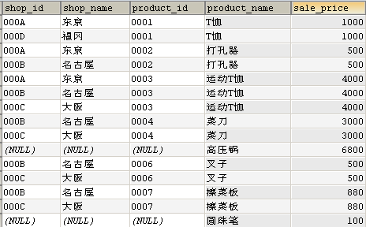

我们观察上述结果可以发现, 有两种商品: 高压锅和圆珠笔, 在所有商店都没有销售. 由于我们在 SELECT 子句选择列的显示顺序以及未对结果进行排序的原因, 这个事实需要你仔细地进行观察。

##### 外连结要点

1. **选取出单张表中全部的信息**

与内连结的结果相比,不同点显而易见,那就是结果的行数不一样.内连结的结果中有 13 条记录,而外连结的结果中有 15 条记录,增加的 2 条记录到底是什么呢?这正是外连结的关键点. 多出的 2 条记录是高压锅和圆珠笔,这 2 条记录在 ShopProduct 表中并不存在,也就是说,这 2 种商品在任何商店中都没有销售.由于内连结只能选取出同时存在于两张表中的数据,因此只在 Product 表中存在的 2 种商品并没有出现在结果之中.相反,**对于外连结来说,只要数据存在于某一张表当中,就能够读取出来.在实际的业务中,例如想要生成固定行数的单据时,就需要使用外连结**.如果使用内连结的话,根据 SELECT 语句执行时商店库存状况的不同,结果的行数也会发生改变,生成的单据的版式也会受到影响,而使用外连结能够得到固定行数的结果.虽说如此,那些表中不存在的信息我们还是无法得到,结果中高压锅和圆珠笔的商店编号和商店名称都是 NULL （具体信息大家都不知道,真是无可奈何）.外连结名称的由来也跟 NULL 有关,即“结果中包含原表中不存在（在原表之外）的信息”.相反,只包含表内信息的连结也就被称为内连结了。

2. **使用 LEFT、RIGHT 来指定主表.**

外连结还有一点非常重要,那就是要把哪张表作为主表.最终的结果中会包含主表内所有的数据.指定主表的关键字是 LEFT 和 RIGHT.顾名思义,使用 LEFT 时 FROM 子句中写在左侧的表是主表,使用 RIGHT 时右侧的表是主表.代码清单 7-11 中使用了 RIGHT ,因此,右侧的表,也就是 Product 表是主表.我们还可以像代码清单 7-12 这样进行改写,意思完全相同.这样你可能会困惑，到底应该使用 LEFT 还是 RIGHT？其实它们的功能没有任何区别,使用哪一个都可以.通常使用 LEFT 的情况会多一些,但也并没有非使用这个不可的理由,使用 RIGHT 也没有问题。

通过交换两个表的顺序, 同时将 LEFT 更换为 RIGHT(如果原先是 RIGHT,则更换为 LEFT), 两种方式会到完全相同的结果。

#### 结合 WHERE 子句使用左连结

上一小节我们学到了外连结的基础用法, 并且在上一节也学习了结合 WHERE 子句使用内连结的方法, 但在结合 WHERE 子句使用外连结时, 由于外连结的结果很可能与内连结的结果不一样, **会包含那些主表中无法匹配到的行, 并用缺失值填写另一表中的列**, 由于这些行的存在, 因此在外连结时使用 WHERE 子句, 情况会有些不一样. 我们来看一个例子:

**练习题:**

使用外连结从 ShopProduct 表和 Product 表中找出那些在某个商店库存少于 50 的商品及对应的商店.希望得到如下结果。

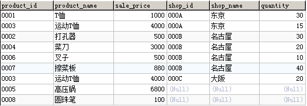

注意高压锅和圆珠笔两种商品在所有商店都无货, 所以也应该包括在内。

按照"结合 WHERE 子句使用内连结"的思路, 我们很自然会写出如下代码

### ON 子句进阶--非等值连结

在刚开始介绍连结的时候, 书上提到过, 除了使用相等判断的等值连结, 也可以使用比较运算符来进行连接. 实际上, 包括比较运算符(<,<=,>,>=, BETWEEN)和谓词运算(LIKE, IN, NOT 等等)在内的所有的逻辑运算都可以放在 ON 子句内作为连结条件。

#### 非等值自左连结(SELF JOIN)

使用非等值自左连结实现排名。

## SQL 高级处理

- 窗口函数种类和应用

- GROUPING 运算符

### 窗口函数

### 窗口函数概念及基本的使用方法

窗口函数也称为**OLAP函数**。OLAP 是 `OnLine AnalyticalProcessing` 的简称，意思是对数据库数据进行实时分析处理。

为了便于理解，称之为 `窗口函数`。常规的SELECT语句都是对整张表进行查询，而窗口函数可以让我们有选择的去某一部分数据进行汇总、计算和排序。

- 窗口函数种类：大致来说，窗口函数可以分为两类。

一是 将SUM、MAX、MIN等聚合函数用在窗口函数中

二是 RANK、DENSE_RANK等排序用的专用窗口函数

窗口函数的通用形式：

```sql

<窗口函数> OVER ([PARTITION BY <列名>]

                     ORDER BY <排序用列名>)

```

[   ]中的内容可以省略。

窗口函数最关键的是搞明白关键字 **PARTITON BY** 和 **ORDER BY** 的作用。

- **PARTITON BY** 是用来分组，即选择要看哪个窗口，类似于 GROUP BY 子句的分组功能，但是 PARTITION BY 子句并不具备 GROUP BY 子句的汇总功能，并不会改变原始表中记录的行数。
- **ORDER BY** 是用来排序，即决定窗口内，是按哪种规则(字段)来排序的。

```sql
SELECT product_name
       ,product_type
       ,sale_price
       ,RANK() OVER (PARTITION BY product_type
                         ORDER BY sale_price) AS ranking
  FROM product;  
```

得到的结果是:

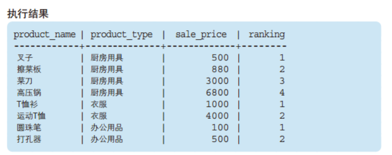

我们先忽略生成的新列 - [ranking]， 看下原始数据在PARTITION BY 和 ORDER BY 关键字的作用下发生了什么变化。

**PARTITION BY 能够设定窗口对象范围**。本例中，为了按照商品种类进行排序，我们指定了product_type。即一个商品种类就是一个小的"窗口"。

**ORDER BY 能够指定按照哪一列、何种顺序进行排序**。为了按照销售单价的升序进行排列，我们指定了sale_price。此外，窗口函数中的ORDER BY与SELECT语句末尾的ORDER BY一样，可以通过关键字ASC/DESC来指定升序/降序。省略该关键字时会默认按照ASC，也就是

升序进行排序。本例中就省略了上述关键字 。

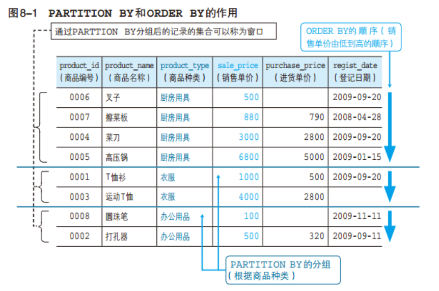

### 专用窗口函数

- **RANK函数**

计算排序时，如果存在相同位次的记录，则会跳过之后的位次。

例）有 3 条记录排在第 1 位时：1 位、1 位、1 位、4 位……

- **DENSE_RANK函数**

同样是计算排序，即使存在相同位次的记录，也不会跳过之后的位次。

例）有 3 条记录排在第 1 位时：1 位、1 位、1 位、2 位……

- **ROW_NUMBER函数**

赋予唯一的连续位次。

例）有 3 条记录排在第 1 位时：1 位、2 位、3 位、4 位

运行以下代码：

```sql

SELECT  product_name

       ,product_type

       ,sale_price

       ,RANK() OVER (ORDER BY sale_price) AS ranking

       ,DENSE_RANK() OVER (ORDER BY sale_price) AS dense_ranking

       ,ROW_NUMBER() OVER (ORDER BY sale_price) AS row_num

  FROM product;

```

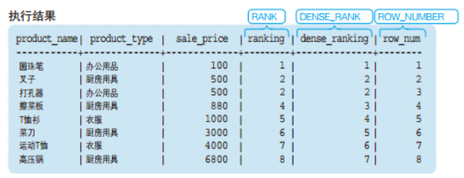

### 聚合函数在窗口函数上的使用

聚合函数在窗口函数中的使用方法和之前的专用窗口函数一样，只是出来的结果是一个**累计**的聚合函数值。

运行以下代码：

```sql

SELECT  product_id

       ,product_name

       ,sale_price

       ,SUM(sale_price) OVER (ORDER BY product_id) AS current_sum

       ,AVG(sale_price) OVER (ORDER BY product_id) AS current_avg

  FROM product;

```

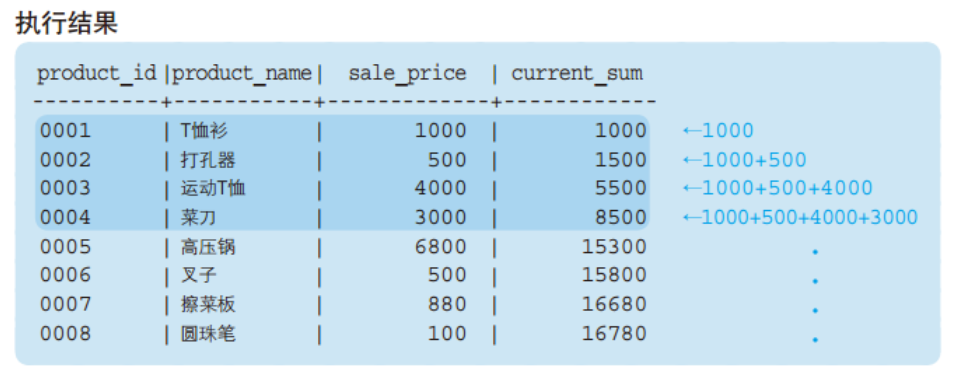

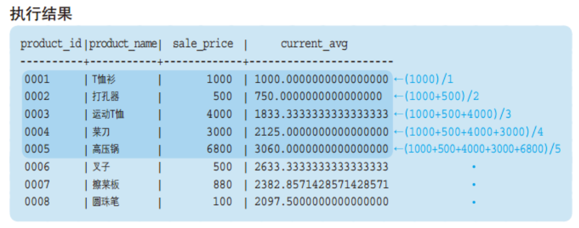

可以看出，聚合函数结果是，按我们指定的排序，这里是product_id，**当前所在行及之前所有的行**的合计或均值。即累计到当前行的聚合。

### 窗口函数的的应用 - 计算移动平均

在上面提到，聚合函数在窗口函数使用时，计算的是累积到当前行的所有的数据的聚合。 实际上，还可以指定更加详细的**汇总范围**。该汇总范围成为 **框架** (frame)。

语法

```sql

<窗口函数> OVER (ORDER BY <排序用列名>

                 ROWS n PRECEDING )


<窗口函数> OVER (ORDER BY <排序用列名>

                 ROWS BETWEEN n PRECEDING AND n FOLLOWING)

```

PRECEDING（“之前”）， 将框架指定为 “截止到之前 n 行”，加上自身行

FOLLOWING（“之后”）， 将框架指定为 “截止到之后 n 行”，加上自身行

BETWEEN 1 PRECEDING AND 1 FOLLOWING，将框架指定为 “之前1行” + “之后1行” + “自身”

执行以下代码：

```sql

SELECT  product_id

       ,product_name

       ,sale_price

       ,AVG(sale_price) OVER (ORDER BY product_id

                               ROWS 2 PRECEDING) AS moving_avg

       ,AVG(sale_price) OVER (ORDER BY product_id

                               ROWS BETWEEN 1 PRECEDING

                                        AND 1 FOLLOWING) AS moving_avg

  FROM product;

```

**执行结果：**

注意观察框架的范围。

ROWS 2 PRECEDING：

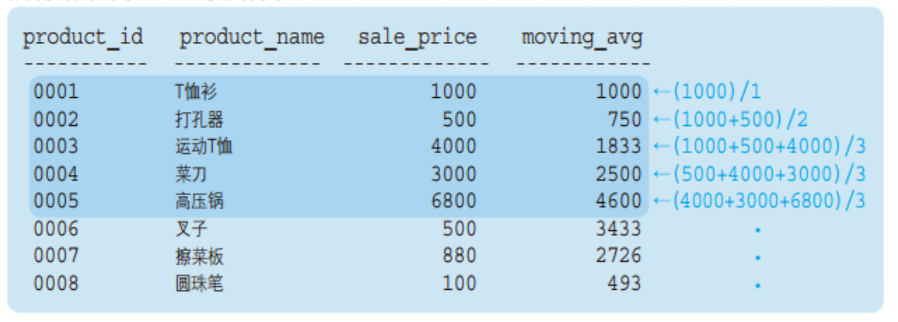

ROWS BETWEEN 1 PRECEDING AND 1 FOLLOWING：

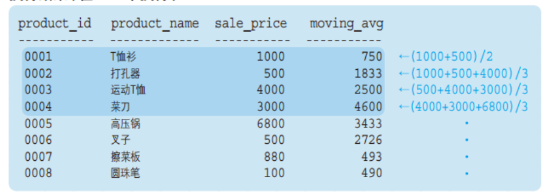

### 窗口函数适用范围和注意事项

- 原则上，窗口函数只能在SELECT子句中使用。
- 窗口函数OVER 中的ORDER BY 子句并不会影响最终结果的排序。其只是用来决定窗口函数按何种顺序计算。

## GROUPING运算符

### ROLLUP - 计算合计及小计

常规的GROUP BY 只能得到每个分类的小计，有时候还需要计算分类的合计，可以用 ROLLUP关键字。

```sql

SELECT  product_type

       ,regist_date

       ,SUM(sale_price) AS sum_price

  FROM product

 GROUP BY product_type, regist_date WITH ROLLUP;

```

得到的结果为：

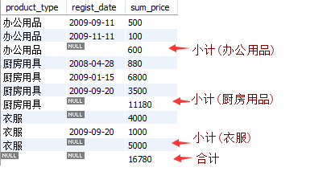

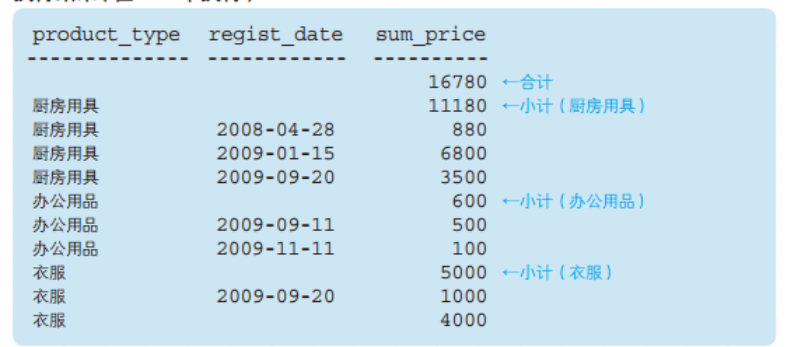

这里ROLLUP 对product_type, regist_date两列进行合计汇总。结果实际上有三层聚合，如下图 模块3是常规的 GROUP BY 的结果，需要注意的是衣服 有个注册日期为空的，这是本来数据就存在日期为空的，不是对衣服类别的合计； 模块2和1是 ROLLUP 带来的合计，模块2是对产品种类的合计，模块1是对全部数据的总计。

ROLLUP 可以对多列进行汇总求小计和合计。

# 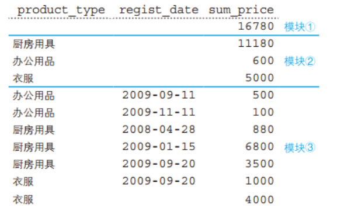

## 注意

拼写单词一定要准确！

我们无法容易地意识到导致缺失值等问题数据的存在

```sql

```
